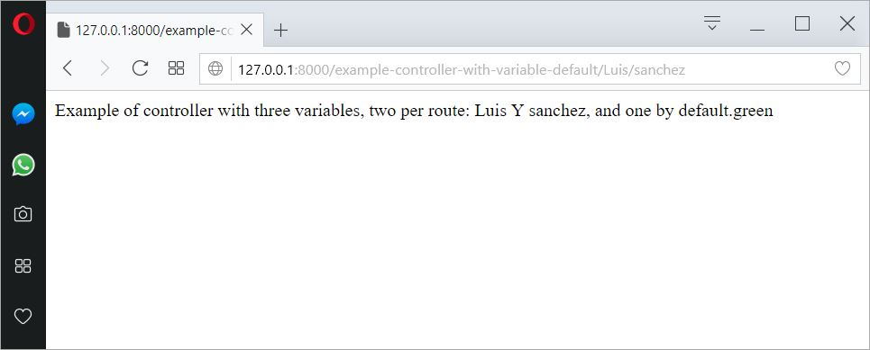

# Purpose of the Demo - 01 Basic Controller

We will create a **Basic Controller**. A Controller is a PHP function that creates and reads information from the Request object, creates and returns the Response object. The answer could be an HTML page, JSON, XML, download files, redirect, 404 error or anything else you can dream of. The use of any logical tool for your application to represent the content of a page.

# Phases of the Demo
1. [Project Creation](#project_creation)
2. [Basic Controller](#2basic_controller)
3. [Basic Controller with a Parameter Default](#3basic_controller_with_a_parameter_default)

---------------------------------------------------------------------------------------

* We will create the project through the console command: `composer create-project symfony/skeleton 01_Basic_Controller`

---------------------------------------------------------------------------------------

# Summary Symfony component`s to use

* [Server Component](https://symfony.com/doc/current/setup.html), `composer require server --dev`
* [Profiler Component](https://symfony.com/doc/current/profiler.html), `composer require --dev profiler`

# Basic Controller

--------------------------------------------------------------------------------------------

## 1.Project Creation

--------------------------------------------------------------------------------------------

1. Created our project using the Console command's, 

```bash
composer create-project symfony/skeleton 01_Basic_Controller
```

2. In the next step we will access the project folder using:

```bash
cd 01_Basic_Controller
```

3. It is necessary to install the **server component**, to use our **Server Local**, through the console command:

```bash
composer require server --dev
```

4. Now, you will be able to view the result of demo when write in the terminal the command console:

```bash
php bin/console server:run
```

--------------------------------------------------------------------------------------------

## 2.Basic Controller

--------------------------------------------------------------------------------------------

_[./src/Controller/DemoController.php](./src/Controller/DemoController.php)_
```php
<?php
// src/Controller/DemoController.php
namespace App\Controller;
use Symfony\Component\HttpFoundation\Response;
use Symfony\Component\Routing\Annotation\Route;

class DemoController {
    public function showControllerWithVariable($slug) {
        return new Response('Controller example with variable value $ slug:'.$slug);
    } 
}
```

The new controller returns a simple HTML page. In order to really test this page in your browser, you must create a path whose path is the **URI** that you want to associate with the controller:

_[./config/routes.yml](./config/routes.yml)_
```yml
app_routing_folder:
    # load routes from a directory with routers stored in yml files
    resource: '..\src\Resources\config\routing\'
    type: directory
```

_[./src/Resources/config/routing/demo.yml](./src/Resources/config/routing/demo.yml)_
```yml
example_controller_with_variable:
    path: /example-controller-with-variable/{slug}
    controller: App\Controller\DemoController::showControllerWithVariable
```

Now, when accessing the URI [/example-controller-with-variable/hello_world](http://127.0.0.1:8000/example-controller-with-variable/hello_world) the controller `DemoController::showControllerWithVariable` is executed and the value **hello_world** is passed as a variable called **$slug**. Again, creating a page simply means that you must create a controller method and an associated path.

When we have it we can see the changes in: [http://127.0.0.1:8000/example-controller-with-variable/hello_world] (http://127.0.0.1:8000/example-controller-with-variable/hello_world)


Note the syntax used to refer to the controller: `DemoController::showControllerWithVariable`. Symfony uses this short notation to refer to the controllers. This is the recommended syntax and tells Symfony to look for a controller class called `DemoController` and then run the `showControllerWithVariable()` method.

--------------------------------------------------------------------------------------------

## 3.Basic Controller with a Parameter Default

--------------------------------------------------------------------------------------------

_[./src/Controller/DemoController.php](./src/Controller/DemoController.php)_
```diff
<?php
// src/Controller/ControllerController.php
namespace App\Controller;
use Symfony\Component\HttpFoundation\Response;
use Symfony\Component\Routing\Annotation\Route;

class DemoController {
  public function showControllerWithVariable($slug) {
    return new Response('Controller example with variable value $ slug:'.$slug);
  }
++ public function showControllerWithVariableDefault($firstName, $lastName, $color) {
++  return new Response('Example of controller with three variables, two per route: '.$firstName.' Y '.$lastName.', and one by default.'.$color);
++ }    
}
```

_[./src/Resources/config/routing/demo.yml](./src/Resources/config/routing/demo.yml)_
```diff
example_controller_with_variable:
    path: /example-controller-with-variable/{slug}
    controller: App\Controller\DemoController::showControllerWithVariable
++example_controller_with_variable_default:
++    path: example-controller-with-variable-default/{firstName}/{lastName}
++    controller: App\Controller\DemoController::showControllerWithVariableDefault
++    defaults:
++        color: green 
```

The variables `{firstName}` and `{lastName}` of the route are called placeholders, since **save the site** for any value to replace this variable. On the other hand, the variable `{color}` is a variable of type default, since its value is always defined for all routes.

When we have it we can see the changes in: **[http://127.0.0.1:8000/example-controller-with-variable-default/Luis/sanchez] (http://127.0.0.1:8000/example-controller-with-variable-default/Luis/sanchez) **

! [Test_Controller_Controller_show_Controller_With_Variable_Default](../../99_Readme_Resources/02_Controller/01_Basic_Controller/basic-controller-variable-default.jpg)

_[./src/Resources/config/routing/demo.yml](./src/Resources/config/routing/demo.yml)_
```diff
example_controller_with_variable:
    path: /example-controller-with-variable/{slug}
    controller: App\Controller\DemoController::showControllerWithVariable
++example_controller_with_variable_default:
++    path: example-controller-with-variable-default/{firstName}/{lastName}
++    controller: App\Controller\DemoController::showControllerWithVariableDefault
--    defaults:
--        color: green
++    #defaults:
++    #    color: green 
```

_[./src/Controller/DemoController.php](./src/Controller/DemoController.php)_
```diff
<?php
// src/Controller/ControllerController.php
namespace App\Controller;
use Symfony\Component\HttpFoundation\Response;
use Symfony\Component\Routing\Annotation\Route;

class DemoController {
  public function showControllerWithVariable($slug) {
    return new Response('Controller example with variable value $ slug:'.$slug);
  }
-- public function showControllerWithVariableDefault($firstName, $lastName, $color) {
++ public function showControllerWithVariableDefault($firstName, $lastName, $color = "green") {
++  return new Response('Example of controller with three variables, two per route: '.$firstName.' Y '.$lastName.', and one by default.'.$color);
++ }    
}
```

When we have it we can see the changes in: **[http://127.0.0.1:8000/example-controller-with-variable-default/Luis/sanchez] (http://127.0.0.1:8000/example-controller-with-variable-default/Luis/sanchez) **

